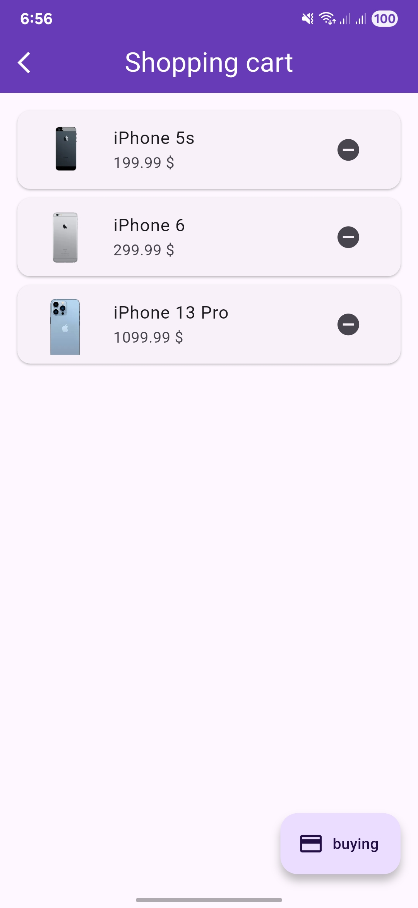

# 📱 SmartCart

A simple Flutter app using **Riverpod (MVVM)** to display smartphones from DummyJSON API with a shopping cart feature.

## Features
- Fetch smartphones from DummyJSON API
- Add/remove items from the cart
- Animated cart badge on FloatingActionButton
- MVVM architecture with **Riverpod** for state management

## 🛠 Tech Stack
- **Flutter** – UI development
- **Riverpod** – State management (MVVM pattern)
- **Dio** – HTTP requests
- **DummyJSON API** – Free products API

## 📸 Screenshots

  
  
  

